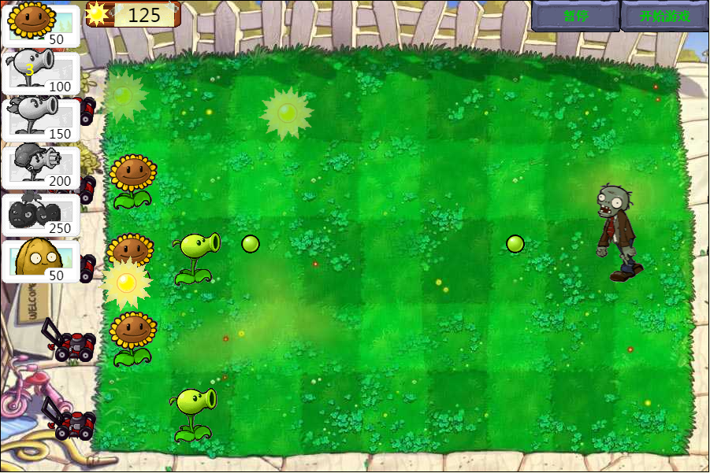

## h5小游戏—植物大战僵尸v1.18

本项目是利用原生js实现的h5小游戏，在实现时使用了大量es6语法，对于es6语法不太熟悉的小伙伴可以先查阅相关资料了解一下

**demo**：[线上地址](https://yangyunhe369.github.io/h5-game-plantsVSzombies/)

**代码详解**：[博客链接](http://www.yangyunhe.me/2018/h5-game-plantsVSzombies/)

## 项目截图



## 已完成功能：
- [x] 绘制游戏场景：背景、阳光计分板、植物卡片（用于放置植物）、植物（6种）、僵尸（1种）
- [x] 植物和僵尸的攻击判定、死亡判定
- [x] 角色动画由一帧一帧图片不停切换绘制实现，可绘制流畅动画效果
- [x] 角色动画根据角色状态自动切换，植物动画包括（普通形态、攻击形态），僵尸动画包括（普通形态、移动形态、攻击形态、濒死形态、死亡形态）
- [x] 阳光自动生成、植物放置需消耗阳光，僵尸随机生成
- [x] 游戏包含僵尸、植物独立胜利条件判定
- [x] 游戏状态：Loading、游戏运行、游戏暂停、游戏结束（玩家胜利）、游戏结束（僵尸胜利）

## 更新代码

v1.1  优化代码，添加向日葵，能自动生成阳光

v1.15 优化代码，修复添加新植物使同行僵尸攻击判定失效bug，添加坚果墙

v1.17 优化代码，添加樱桃炸弹

v1.18 优化代码，添加除草车可清除整行僵尸

v1.2  优化代码，添加食人花

## 下载源码

``` bash
git clone https://github.com/yangyunhe369/h5-game-plantsVSzombies.git
```

## 目录结构

```
.
├─ index.html                   // 首页html
│  
├─ css                          // css样式资源文件
├─ images                       // 图片资源文件  
└─ js
   ├─ common.js                 // 公共方法
   ├─ scene.js                  // 游戏场景相关类
   ├─ game.js                   // 游戏主要运行逻辑
   └─ main.js                   // 游戏运行主函数
```

* common.js => 引入公共方法
* scene.js => 引入游戏场景素材相关类，包括角色类、动画类
* game.js => 引入游戏引擎
* main.js => 游戏运行主函数

## 说明

如果对您有帮助，您可以点右上角 "Star" 支持一下 谢谢！ ^_^

或者您可以 "follow" 一下，我会不断开源更多的有趣的项目

## 个人简介

作者：弦云孤赫(David Yang)

职业：web前端开发工程师

爱好：网游、音乐（吉他）

## 联系方式

QQ：314786482

微信：yangyunhe_yyh

坐标：四川成都

## License

[MIT](https://github.com/yangyunhe369/h5-game-plantsVSzombies/blob/master/LICENSE)
